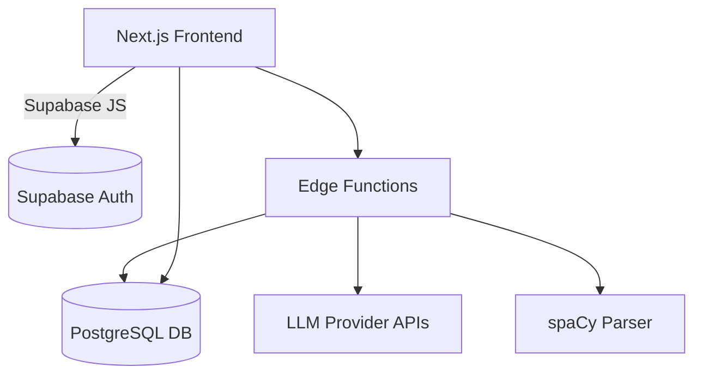

### 1. Executive Summary  

**Primary Value Propositions**  
1. Single-screen comparison of how multiple AI assistants mention local businesses.  
2. Automated extraction and ranking of brand mentions without manual review.  
3. Historical visibility trends for each brand, turning unstructured AI replies into actionable metrics.  
4. Free-tier hosting, database, and model usage—fully operational at near-zero cost.  
5. Mobile-first UX enabling on-the-go insights for busy owners and marketers.

**Strategic Alignment**  
• Helps local businesses reclaim organic discovery as search shifts from SEO to AI answers.  
• Positions the company as an early leader in the emerging Answer Engine Optimization niche.  
• Demonstrates a lightweight, cost-efficient SaaS model that can scale with paid tiers later.

**Core Benefits**  
• Faster competitive intelligence (minutes vs. hours of manual prompts).  
• Evidence-based AEO strategy backed by time-series data.  
• No technical setup—just sign in and start tracking queries.

**Success Definition**  
• ≥10 beta users actively tracking ≥3 queries within 30 days.  
• ≥80 % of stored runs successfully parsed with correct brand ranking.  
• Operating costs ≤ $50 / month while supporting up to 1 000 stored runs.

---

### 2. Scope Definition  

**In Scope (MVP)**  
1. Manual query input to fetch responses from 3 free/low-cost models: ChatGPT (web), Perplexity (web), Claude (web).  
2. Real-time API integration with search-enabled LLM models (ChatGPT gpt-4o-search-preview, Perplexity Sonar, Gemini Flash, Claude).  
3. Brand extraction using dictionary match + open-source NER (spaCy on Cloud-flare Workers).  
4. Basic dashboard: side-by-side replies, highlighted brands, simple line chart of rank over time.  
5. Supabase (free tier) for auth, storage, and scheduled functions (daily/weekly runs).  
6. Vercel (hobby tier) hosting for Next.js app.  
7. Email onboarding + weekly summary via Resend free tier.

**Out of Scope**  
1. Paid API integrations (e.g., Grok).  
2. Sentiment analysis of brand mentions.  
3. Automated keyword suggestion engine.  
4. Multi-tenant billing / paid plans.  
5. Mobile apps (native).

**Future Considerations**  
• Sentiment scoring, competitor gap analysis, push notifications.  
• Full OAuth-based connections to premium LLM APIs.  
• AI-generated optimization recommendations.  
• Team collaboration features and role-based access.

---

### 3. Target Market & User Analysis  

#### 3.1 Ideal Customer Profile (ICP)  
• **Company Characteristics:** 1–10 locations, service-oriented (food, health, beauty), revenue $0.5–5 M, US/EU cities.  
• **Technology Profile:** Uses Google Business Profile, basic SEO tools; minimal dev resources.  
• **Business Context:** Needs visibility vs. local rivals in new AI answer boxes; budget <$100 / mo.  
• **Success Criteria:** Increase “first-mention” share of answers by 20 % within 3 months.

#### 3.2 User Personas  

1. **Local Marketing Manager**  
   • Goals: Track brand presence weekly, create reports for owners.  
   • Pain: Manual prompting, no historical data.  
   • Tech Proficiency: Intermediate SaaS.  
   • Decision Influence: High.

2. **Small Business Owner**  
   • Goals: Know if their shop is recommended by ChatGPT.  
   • Pain: Time constraint, low tech skills.  
   • Tech Proficiency: Low-moderate.  
   • Decision Influence: Full.

3. **SEO Consultant**  
   • Goals: Provide new service line (AEO) to clients.  
   • Pain: Lack of tooling; difficult to prove ROI.  
   • Tech Proficiency: High.  
   • Decision Influence: Advisory.

---

### 4. User Stories & Acceptance Criteria  

**4.1 Core User Stories**  
1. As a Marketing Manager, I want to enter a question and view AI replies side-by-side so that I can compare brand mentions quickly.  
2. As a Business Owner, I want an email summary of my brand ranking each week so that I know if visibility improves.  
3. As an SEO Consultant, I want to export ranking history as CSV so that I can include it in client reports.

**4.2 Detailed User Flows**  

• **Primary Workflow – “Run Query”**  
  1. Login → Dashboard → “New Query”.  
  2. Enter question, select frequency (manual/weekly).  
  3. System calls 3 model APIs, stores raw replies.  
  4. Parser extracts brands, ranks, saves snapshot.  
  5. UI displays comparison view and saves to history.

• **Success Scenario:** All 3 replies load <10 s; correct brands highlighted; snapshot appears in history list.  

• **Edge Cases:**  
  – Model API unavailable or rate-limited → show retry option.  
  – No brand matched → display “No recognized brands”.  
  – Duplicate query name → prompt to rename.

• **Acceptance Criteria:**  
  – ≥95 % of manual runs complete <15 s.  
  – Rank algorithm matches ground truth in QA set with ≥90 % precision.  

---

### 5. Feature Specifications  

#### 5.1 Feature Hierarchy  

| Feature | Priority | Complexity | User Value |
|---|---|---|---|
| Query Runner & API Integration | Critical | Moderate | High |
| Brand Extraction Engine | Critical | Moderate | High |
| Comparison View UI | High | Simple | High |
| Historical Chart | High | Simple | Medium |
| Weekly Email Digest | Medium | Simple | Medium |
| CSV Export | Low | Simple | Low |

#### 5.2 Detailed Requirements (Key Features)  

1. **Query Runner & API Integrations**  
   • Functional: Invoke LLM provider APIs (gpt-4o-search-preview, sonar, gemini-2.5-flash, claude) with the user prompt; capture plaintext response.  
   • UI: Progress spinner; show timestamps.  
   • Data: Store prompt, model, raw response text (JSON string).  
   • Business Rules: Respect provider rate limits; max 3 runs/min/user.  
   • Integration: Direct LLM APIs via Supabase Edge Function scheduler.  
   • Performance: ≤10 s per model call.

2. **Brand Extraction Engine**  
   • Functional: Run spaCy NER + dictionary match of monitored brands; output ordered list.  
   • UI: Highlight brands in color.  
   • Data: JSON {brand, rank, model, run_id}.  
   • Business Rules: If list ordered numerically in text, keep that order; else first appearance order.  
   • Integration: Supabase Edge Functions.  
   • Performance: ≤200 ms per reply.

3. **Comparison View UI**  
   • Functional: Responsive cards per model; copy-to-clipboard.  
   • UI Requirements: Works down to 320 px width; dark/light theme.  
   • Accessibility: WCAG AA; keyboard nav.  

---

### 6. Technical Architecture & Implementation  

#### 6.1 Technology Stack & Architecture Decision  
• **Frontend:** Next.js + TypeScript + Tailwind (rapid dev, Vercel free).  
• **Backend/API:** Supabase Edge Functions (Serverless, free tier).  
• **Database:** Supabase Postgres (row-level security, free).  
• **Authentication:** Supabase Auth (email/password).  
• **Hosting & Infrastructure:** Vercel Hobby + Supabase free project.  
• **Development Tools:** Playwright tests, ESLint, Prettier, GitHub Actions CI.

#### 6.2 Application Scaffolding & Structure  
```
aeo-mvp/
|-- README.md
|-- package.json
|-- tsconfig.json
|-- .github/workflows/ci.yml
|-- public/
|-- app/
|   |-- layout/
|   |-- page.tsx
|   |-- queries/
|   |   |-- NewQueryForm.tsx
|   |   |-- QueryResult.tsx
|   |-- components/
|   |   |-- ui/
|   |   |-- charts/
|   |-- lib/
|   |   |-- supabase.ts
|   |   |-- scraping.ts
|   |   |-- parsing.ts
|   |-- hooks/
|   |-- styles/
|-- supabase/
|   |-- migrations/
|   |-- seeds.sql
|-- docs/
```

#### 6.3 Database Schema Design  
```
-- Users
create table users (
  id uuid primary key default gen_random_uuid(),
  email text unique not null,
  created_at timestamptz default now()
);

-- Queries
create table queries (
  id uuid primary key default gen_random_uuid(),
  user_id uuid references users(id),
  prompt text not null,
  schedule text default 'manual', -- manual | weekly
  created_at timestamptz default now()
);

-- Runs
create table runs (
  id uuid primary key default gen_random_uuid(),
  query_id uuid references queries(id),
  model text not null,
  raw_response text,
  created_at timestamptz default now()
);

-- Brands
create table brands (
  id uuid primary key default gen_random_uuid(),
  user_id uuid references users(id),
  name text not null
);

-- Mentions
create table mentions (
  run_id uuid references runs(id),
  brand_id uuid references brands(id),
  rank int,
  primary key (run_id, brand_id)
);

alter table users enable row level security;
create policy "Users see own data"
on users for select using (auth.uid() = id);

-- Indexes
create index idx_brands_name on brands(name);
```

Seed data: default demo brands; demo queries.

#### 6.4 API Design & Endpoints  

| Method | Endpoint | Auth | Purpose |
|---|---|---|---|
| POST | /api/query | Yes | Create new query |
| GET | /api/query/:id | Yes | Get query + history |
| POST | /api/run | System | Trigger scrape (Edge Function) |
| GET | /api/brands | Yes | List brands |
| POST | /api/export | Yes | Return CSV |

Standard JSON schema; errors `{code, message}`; rate limit 60 req/min/user.

#### 6.5 System Architecture Diagram  


---

### 7. Detailed Task Breakdown & Planning  

#### 7.1 Development Tasks by Category  

**Infrastructure & Setup**  
| ID | Task | Acceptance | Dep. | Effort | Skills | Priority |
|---|---|---|---|---|---|---|
| INF-1 | Provision Supabase project | Project created, RLS enabled | — | XS | DevOps | Critical |
| INF-2 | Vercel deployment pipeline | Auto-deploy on main branch | INF-1 | S | DevOps | High |

**Frontend**  
| FE-1 | Build Query Form | Submit prompt, validate | INF-2 | M | React | Critical |
| FE-2 | Comparison View Cards | Responsive, brands highlighted | FE-1 | M | React/Tailwind | High |
| FE-3 | History Chart | Line chart rank over time | FE-2 | S | D3/Chart.js | High |
| FE-4 | CSV Export button | Download correct file | FE-3 | XS | JS | Low |

**Backend**  
| BE-1 | LLM API Integration Function | Returns raw text | INF-1 | M | TS, OpenAI/Anthropic APIs | Critical |
| BE-2 | Parsing Function | Inserts mentions | BE-1 | M | Python/TS, spaCy | Critical |
| BE-3 | Scheduler | Weekly cron triggers runs | BE-1 | S | TS | Medium |

**Quality Assurance**  
| QA-1 | Unit tests parsing accuracy | ≥90 % precision | BE-2 | S | Playwright/Jest | High |
| QA-2 | E2E run from form to dashboard | Passes CI | FE-1-3, BE-1-2 | M | Playwright | High |

---

_End of PRD_